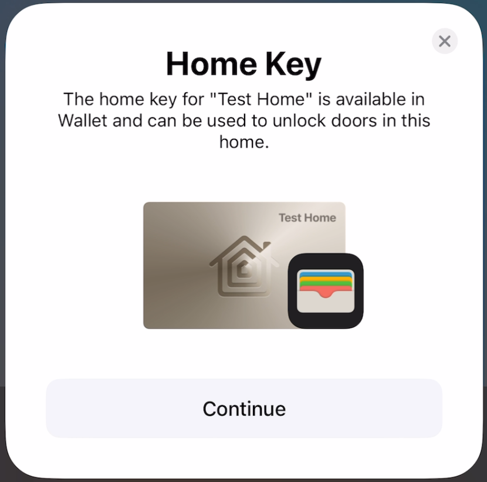
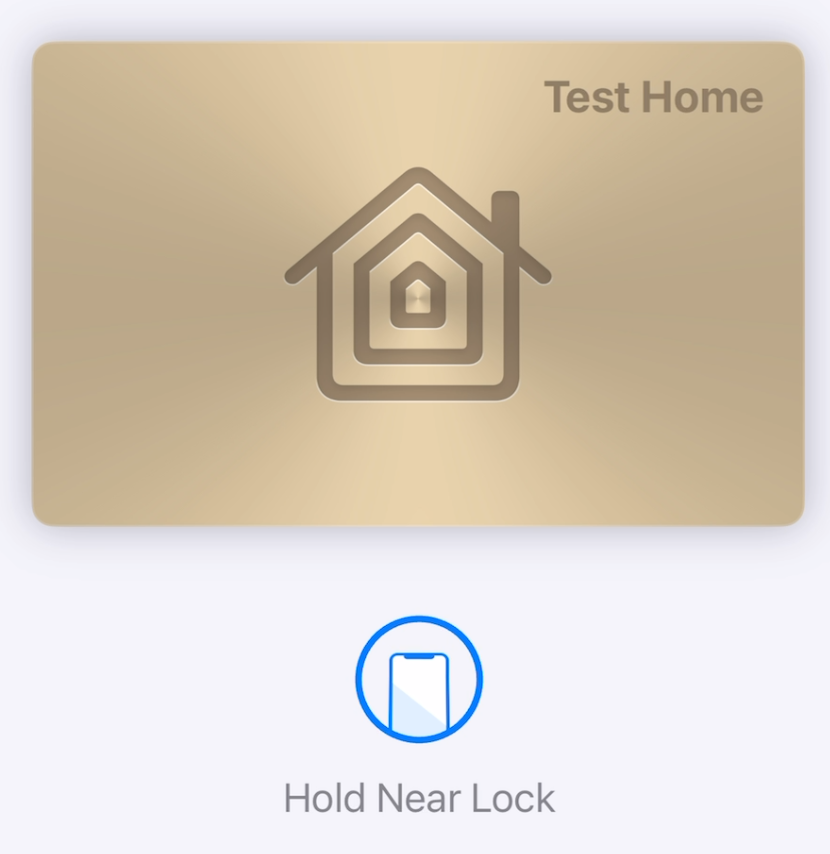
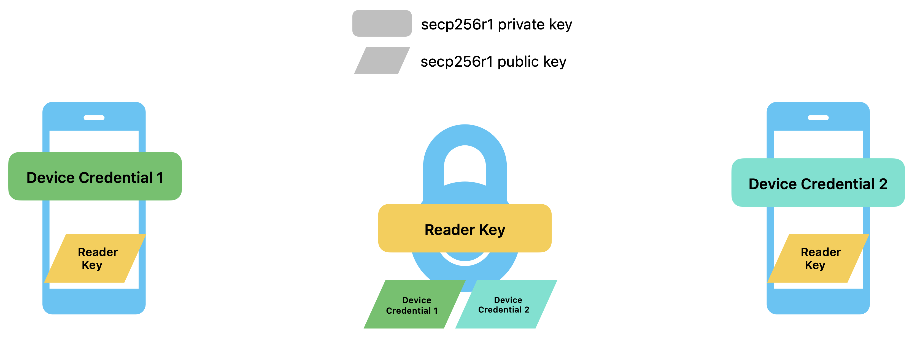

# Apple HomeKey


This documentation is intended only for studying purposes. Most of the information provided here is based on reverse engineering, guessing and testing (trial-and-error). So the documentation may be inaccurate or incomplete.

## Overview
HomeKey is a proprietary technology which allows to unlock a compatible smart lock by tapping it with a mobile device (phone or watch). Although the NFC lock is setup like a regular lock via HomeKit, the data exchange while tapping is based on NFC. For this purpose a digital key is automatically generated and stored in the Wallet app.

 

So HomeKeys use two technologies:
1. HomeKit
   * Required for lock setup, manual locking/unlocking and credential exchange
2. NFC
   * Data exchange between the lock (reader) and the phone

## How it works
When a NFC capable smart lock is added via HomeKit, the phone generates two things:

* The **Reader Key** (a secp256r1 key pair)
* The **Device Credential** (another secp256r1 key pair)

The private part of the **Reader Key** is sent to the smart lock and stored there. Its purpose is to authenticate the lock againts the phone during a NFC transaction. Only one Reader Key exists for each home.

The public part of the **Device Credential** is also sent to the smart lock and stored there. The Device Credential is unique per device (phone or watch) and used to identify and authenticate the device at the lock during a NFC transaction. Each device invited to the home generates its own Device Credential which is then sent to the lock. A lock can store multiple Device Credentials.



## HomeKit specification
A HomeKey compatible lock utilizes the same services and characteristics as a normal HomeKit lock, but exposes additional services and characteristics. Only the HomeKey specific ones are described here.

---

### Services
| Name                   | UUID                                     |
| ---------------------- | ---------------------------------------- |
| NFC Access             | 00000266-0000-1000-8000-0026BB765291     |

---

### Characteristics (overview)
**Service "NFC Access"**
| Name                               | UUID                                     | Type                   | Purpose                                                    |
| ---------------------------------- | ---------------------------------------- | ---------------------- | ---------------------------------------------------------- |
| Configuration State                | 00000263-0000-1000-8000-0026BB765291     | UINT16 - read only     | *unknown*                                                  |
| NFC Access Control Point           | 00000264-0000-1000-8000-0026BB765291     | TLV8 - write-response  | Key and credential provisioning                            |
| NFC Access Supported Configuration | 00000265-0000-1000-8000-0026BB765291     | TLV8 - read only       | Number of credentials that can be stored in the lock       |

**Service "Accessory Information"**
| Name                               | UUID                                     | Type                   | Purpose                                                    |
| ---------------------------------- | ---------------------------------------- | ---------------------- | ---------------------------------------------------------- |
| Hardware Finish                    | 0000026C-0000-1000-8000-0026BB765291     | TLV8 - read only       | Color of the Digital Key in the Wallet app                 |

---

### Characteristic "Hardware Finish"
This characteristic is optional and allows to specify the color of the virtual HomeKey in the Wallet app.

TLV8 encoding:
| Description                 | Type        | Length       | Value                                                                                                                                                                                                    |
| --------------------------- | ----------- | ------------ | -------------------------------------------------------------------------------------------------------------------------------------------------------------------------------------------------------- |
| Wallet Key Color            | 1           | 4            | One of the following values (hexadecimal):<br>`0xCED5DA00: Tan (default)`<br>`0xAAD6EC00: Gold`<br>`0xE3E3E300: Silver`<br>`0x00000000: Black`                                                                   |

Example response:
`0104CED5DA00`

---

### Characteristic "NFC Access Supported Configuration"
I'm not sure about the purpose of this characteristic - maybe it's used to tell the phone how many different user credentials can be stored on the lock.

TLV8 encoding:
| Description                                               | Type        | Length       | Value                                                                                                                                                                                                    |
| --------------------------------------------------------- | ----------- | ------------ | -------------------------------------------------------------------------------------------------------------------------------------------------------------------------------------------------------- |
| Number of Issuer Keys                                     | 1           | 1            | Number                                                                                                                                                                                                   |
| Number of inactive credentials                            | 2           | 1            | Number                                                                                                                                                                                                   |

Example response:
`010110020110`

Hint: The Issuer Key seems to be identical for all devices on the same iCloud account.

---

### Characteristic "NFC Access Control Point"
This characteristic is used to provision the Reader Key and the Device Credentials in the lock.

The phone always sends a write request containing a TLV8 object to the lock - and the lock then answers that with a TLV8 response.

TLV8 encoding:
| Description                                               | Type        | Length       | Value                                                                                                                                                                                                    | Presence                  |
| --------------------------------------------------------- | ----------- | ------------ | -------------------------------------------------------------------------------------------------------------------------------------------------------------------------------------------------------- | ------------------------- |
| Operation                                                 | 1           | 1            | `1: get`<br>`2: add`<br>`3: remove`                                                                                                                                                                      | Request only              |
| Device Credential Request                                 | 4           | N            | Sub-TLV8, see table "Device Credential Request"                                                                                                                                                          | Request only              |
| Device Credential Response                                | 5           | N            | Sub-TLV8, see table "Device Credential Response"                                                                                                                                                         | Response only             |
| Reader Key Request                                        | 6           | N            | Sub-TLV8, see table "Reader Key Request"                                                                                                                                                                 | Request only              |
| Reader Key Response                                       | 7           | N            | Sub-TLV8, see table "Reader Key Response"                                                                                                                                                                | Response only             |

Sub-TLV8 encoding of "Device Credential Request":
| Description                                               | Type        | Length       | Value                                                                                                                                                                                                    | Presence                                         |
| --------------------------------------------------------- | ----------- | ------------ | -------------------------------------------------------------------------------------------------------------------------------------------------------------------------------------------------------- | ------------------------------------------------ |
| Key type                                                  | 1           | 1            | `1: curve25519 (not seen yet)`<br>`2: secp256r1`                                                                                                                                                         | Operation "add"                                  |
| Device Credential Public Key                              | 2           | 64           | secp256r1 Public Key (X and Y coordinates concatenated)                                                                                                                                                  | Operation "add"                                  |
| Issuer Key Identifier                                     | 3           | 8            | 8 Byte Issuer Identifier (seems to be identical for all devices on the same iCloud account)                                                                                                              | Operation "add"                                  |
| Key state                                                 | 4           | 1            | `0: inactive (not seen yet)`<br>`1: active`                                                                                                                                                              | Operation "add"                                  |
| Key Identifier                                            | 5           | ?            | ?                                                                                                                                                                                                        | Probably operation "remove" (not seen yet)       |

Sub-TLV8 encoding of "Device Credential Response":
| Description                                               | Type        | Length       | Value                                                                                                                                                                                                    | Presence                                         |
| --------------------------------------------------------- | ----------- | ------------ | -------------------------------------------------------------------------------------------------------------------------------------------------------------------------------------------------------- | ------------------------------------------------ |
| Key identifier                                            | 1           | ?            | ?                                                                                                                                                                                                        | Probably operation "get" (not seen yet)          |
| Issuer Key Identifier                                     | 2           | 8            | 8 Byte Issuer Identifier of the provisioned Device Credential                                                                                                                                            | Operation "add"                                  |
| Status                                                    | 3           | 1            | `0: success`<br>`1: out of resources`<br>`2: duplicate`<br>`3: does not exist`<br>`4: not supported`                                                                                                     | Operations "add" and "remove"                    |

Sub-TLV8 encoding of "Reader Key Request":
| Description                                               | Type        | Length       | Value                                                                                                                                                                                                    | Presence                                         |
| --------------------------------------------------------- | ----------- | ------------ | -------------------------------------------------------------------------------------------------------------------------------------------------------------------------------------------------------- | ------------------------------------------------ |
| Key type                                                  | 1           | 1            | `1: curve25519 (not seen yet)`<br>`2: secp256r1`                                                                                                                                                         | Operation "add"                                  |
| Reader Private Key                                        | 2           | 32           | secp256r1 Private Key                                                                                                                                                                                    | Operation "add"                                  |
| *Unknown*                                                 | 3           | 8            | 8 Byte Identifier (seems to be unique per reader, no known usage)                                                                                                                                        | Operation "add"                                  |
| Key Identifier                                            | 4           | 8            | Identifier for Reader Private Key (see description below how to calculate)                                                                                                                               | Operation "remove"                               |

Sub-TLV8 encoding of "Reader Key Response":
| Description                                               | Type        | Length       | Value                                                                                                                                                                                                    | Presence                                         |
| --------------------------------------------------------- | ----------- | ------------ | -------------------------------------------------------------------------------------------------------------------------------------------------------------------------------------------------------- | ------------------------------------------------ |
| Key Identifier                                            | 1           | 8            | Identifier for Reader Private Key (see description below how to calculate)                                                                                                                               | Operation "get"                                  |
| Status                                                    | 2           | 1            | `0: success`<br>`1: out of resources`<br>`2: duplicate`<br>`3: does not exist`<br>`4: not supported`                                                                                                     | Operations "add" and "remove"                    |

Calculation of the Identifier for Reader Private Key ("Reader Identifier"):
```
SHA256( concatenate( 0x6B65792D6964656E746966696572, readerPrivateKey ) ) --> first 8 Bytes is the Reader Identifier
```
"0x6B65792D6964656E746966696572" is the hexadecimal representation (as byte array) for "key-identifier" encoded in ASCII.

Example request "get configured reader key" (no reader key configured):
```
Request:
  01 01 01   --> Operation "get"
  06 00      --> Sub-TLV8 "Reader Key Request" (empty in this case)

Response:
  <empty>
```

Example request "configure reader key":
```
Request:
  01 01 02                                        --> Operation "add"
  06 2f                                           --> Sub-TLV8 "Reader Key Request"
    01 01 02                                      --> Key type "secp256r1"
    02 20 84b660e12d9ec8a331bc65f071cb3679(...)   --> Reader Private Key (secp256r1)
    03 08 a1b2c3d4e5f6a7b8                        --> 8 Byte Identifier (usage not known)

Response:
  07 03        --> Sub-TLV8 "Reader Key Response"
    02 01 00   --> Status "success"
```

Example request "get configured reader key" (reader key configured):
```
Request:
  01 01 01   --> Operation "get"
  06 00      --> Sub-TLV8 "Reader Key Request" (empty in this case)

Response:
  07 0a                      --> Sub-TLV8 "Reader Key Response"
    01 08 94625fd2c32cf3c2   --> Reader Identifier (see description above how to calculate)
```

Example request "provision device credential":
```
Request:
  01 01 02                                        --> Operation "add"
  04 52                                           --> Sub-TLV8 "Device Credential Request"
    01 01 02                                      --> Key type "secp256r1"
    02 40 970eead94f9564a85dbafa06abb04293(...)   --> Device Credential Public Key (secp256r1)
    03 08 12ab34cd56ef0815                        --> Issuer Key Identifier
    04 01 01                                      --> Key state "active"

Response:
  05 0d                      --> Sub-TLV8 "Device Credential Response"
    02 08 12ab34cd56ef0815   --> Issuer Key Identifier
    03 01 00                 --> Status "success"
```

## NFC specification
HomeKeys use nearly the same protocol as Digital Car Keys. **The specifications for this Digital Key protocol are publicly available** (see the links section below). Therefore the protocol isn't described here in detail. Instead, this section will provide an overview how the protocol is used in the context of HomeKeys and which parts are different. For those interested in a more detailed overview and communication examples: [@kormax](https://github.com/kormax/apple-home-key) did also research this topic, including the attestation exchange mechanism, which is not covered here.

### HomeKey transaction overview
HomeKeys can use both transaction types described in the Digital Key specification:

* Standard Transaction
* Fast Transaction

A Standard Transaction can always be performed. A Fast Transaction is possible only after a successful Standard Transaction (because the secret required to verify the cryptogram is shared during a Standard Transaction).

The following picture illustrates the command flow of a Standard Transaction:


1. SELECT:
   * The lock (= NFC reader) selects the HomeKey applet inside the secure element (SE) of the phone.
   * The phone answers with a list of supported applet versions (more details below).
2. AUTH 0:
   * The lock creates an ephemeral secp256r1 key pair and sends the following data to the phone:
      * Selected applet version
      * The public key part of the generated secp256r1 key pair
      * A randomly generated transaction identifier
      * The **Reader Identifier**, which is used in place of the Vehicle Identifier from the Digital Key specification
   * The phone also creates an ephemeral secp256r1 key pair and sends its public key to the lock.
3. AUTH 1:
   * The lock creates a signature over the following data and sends it to the phone:
      * The Reader Identifier
      * The X coordinate of the phone's ephemeral public key
      * The X coordinate of the lock's ephemeral public key
      * The (randomly generated) transaction identifier
      * A fixed value
   * The phone checks the signature and sends the following data to the lock in encrypted form:
      * The identifier of the Device Credential (see information below how to calculate)
      * A signature over the following data:
         * The Reader Identifier
         * The X coordinate of the phone's ephemeral public key
         * The X coordinate of the lock's ephemeral public key
         * The (randomly generated) transaction identifier
         * Another fixed value
4. CONTROL FLOW:
   * The lock tells the phone if the transaction was successful.
   * The phone either displays a checkmark or an error.

Between steps **2** and **3** the encryption keys are derived via a key agreement protocol and shared info.

After step **3**, the lock decrypts the message, checks if it has a matching Device Credential and then verifies the signature. If the signature is correct, the phone is authenticated and the transaction succeeds.

This is how the identifier for the Device Credential is calculated:
```
SHA1( concatenate( 0x04, deviceCredentialPublicKey ) ) --> first 6 Bytes
```

The uncompressed format of the secp256r1 public key is used here, thus the "0x04" prefix.

### Enhanced Contactless Polling (ECP)

Enhanced Contactless Polling is a proprietary extension for the standard ISO 14443 polling sequence. It's implemented inside the NFC reader (in this case the smart lock) in order to tell the phone which digital credential or pass it has to select before the communication starts. A very detailed research on this topic has been done by [@kormax](https://github.com/kormax/apple-enhanced-contactless-polling).

In the case of HomeKeys, the reader sends the following ECP frame between regular ISO 14443 request/wakeup frames:

```
6a 02 cb 02 04 021100 <8 byte Reader Identifier> <CRC-16>
```

For example, if the Reader Identifier is "94625fd2c32cf3c2", the ECP sequence would be:

```
6a 02 cb 02 04 021100 94625fd2c32cf3c2 dd38
```

### Application Identifier (AID)

The HomeKey applet can be selected using the following ISO 7816 application identifier:

```
a00000085801010100000001
```

### Applet versions

* Version 1.0 (0x0100):
   * Uses the **Reader Identifier** (8 bytes, see HomeKit section for details) in place of the "Vehicle Identifier"
   * No further changes, transaction follows the Digital Key specification for applet version 1.0
* Version 2.0 (0x0200):
   * Uses a combined value (16 bytes) in place of the "Vehicle Identifier", which is a concatenation of the following data:
      * The original **Reader Identifier** (8 bytes)
      * An unique lock identifier (8 bytes) *(probably generated during lock setup)*
   * Uses a modified/different key derivation method --> see the section below for more details

So currently version 1.0 can be used without problems, while version 2.0 ~~requires further research~~ --> see below

### Key derivation and cryptogram verification for applet version 2.0

**Standard Transaction**: The following data is appended to the shared info for (session and persistent) key derivation:

* List of supported Digital Key applet versions

For example, if the phone reports to support applet versions 2.0 and 1.0, the following data is appended to the shared info:
```
(...) 5C 04 02000100
```

**Fast Transaction**: The cryptogram calculation was removed. Instead, the first 16 bytes of the key derivation function output is used as the cryptogram. For this purpose, the shared info for the KDF has been modified. It now contains the following data (in exactly this order):

* The X coordinate of the Reader Public Key
* A fixed value
* Concatenation of Reader Identifier and the unique lock identifier
* The X coordinate of the Device Credential Public Key
* Interface Byte
* List of supported applet versions, prepended with TLV tag and length bytes (as in the Standard Transaction)
* Selected applet version, prepended with TLV tag and length bytes
* The X coordinate of the lock's ephemeral public key
* The transaction identifier
* Flag
* The X coordinate of the phone's ephemeral public key

## Useful links and documents
* https://github.com/kormax/apple-home-key
* https://github.com/kormax/apple-enhanced-contactless-polling
* https://github.com/KhaosT/HAP-NodeJS/commit/80cdb1535f5bee874cc06657ef283ee91f258815
* https://github.com/homebridge/HAP-NodeJS
* https://github.com/RfidResearchGroup/proxmark3
* https://carconnectivity.org/digital-key/
* https://patents.google.com/patent/EP3748900A1/
* https://developer.apple.com/videos/play/wwdc2020/10006/
* https://developer.apple.com/bug-reporting/profiles-and-logs/
* https://developer.apple.com/documentation/
* HomeKit Accessory Protocol Specification Non-Commercial Version R2